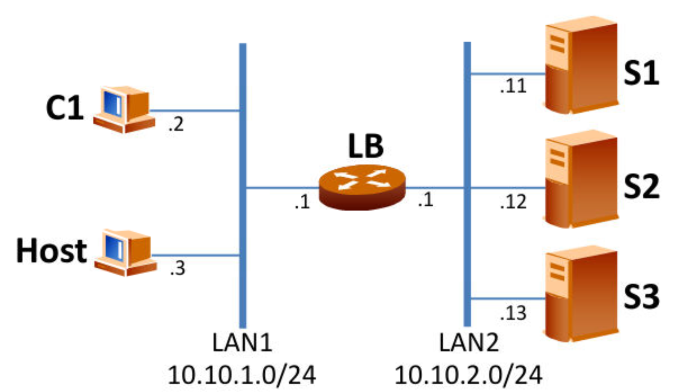

# Automatización de escenario virtual de balanceo de carga

Este script provee de ciertas opciones que permitiran al usuario crear el escenario siguiente:



Así como controlar su ejecución, monitorizarlo o destruirlo.

## Incluir este script en el el PATH para poder ejecutarlo desde cualquier sitio
Para trabajar más cómodamente con el script, se recomienda incluirlo en el PATH con la orden siguiente:

```
sudo ln auto-p2.py /usr/local/bin/auto-p2
```

Si el script no se incluye en el PATH, habrá que ejecutarlo desde la carpeta donde está el mismo con `./auto-p2 [...]` 

## Ayuda con el script
Simplemente ejecútelo con el flag `--help` para encontrar indicaciones acerca de su uso.

# Requisitos

Primeramente habrá que descargar los ficheros base sobre los que se crean la máquinas virtuales que componen el escenario.


añadir permisos de ejecucción al script
pip3 install -r requirements.txt
./download-requirements.sh


acerca de la nueva orden cleanup
